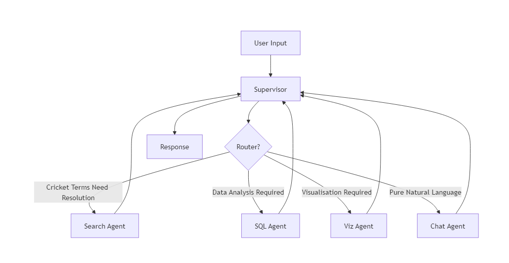

# CSQL-Agent: Cricket Analytics Assistant

CSQL-Agent is an intelligent cricket analytics assistant powered by LangGraph and LangChain. It allows users to analyze cricket data through natural language queries, SQL generation, and data visualization.

## Overview

This project implements a conversational AI system that can:
- Search for cricket-related entities (players, teams, grounds, etc.)
- Execute SQL queries against cricket databases
- Generate visualizations of cricket statistics
- Provide insights and analysis through a chat interface

The system follows an OpenAI-compatible API format, making it easy to integrate with various frontends.

## Architecture   
   

The project is built with a modular agent-based architecture:

- **Supervisor Agent**: Orchestrates the workflow and routes queries to specialized agents
- **Search Agent**: Looks up specific entities in the cricket database
- **SQL Agent**: Generates and executes SQL queries to analyze cricket statistics
- **Visualization Agent**: Creates charts and graphs from cricket data


The system uses LangGraph to manage the agent workflows and state transitions.

## Key Features

- **Natural Language Processing**: Understands cricket-specific terminology and queries
- **Database Integration**: Connects to cricket databases with different schemas
- **Multi-step Reasoning**: Uses a supervisor to determine the optimal processing strategy
- **Data Visualization**: Creates charts and visualizations on demand

## Database Tables

The system works with multiple cricket databases:

- **hdata**: Primary T20 Ball-By-Ball Database (includes IPL matches) from 2015 onwards
- **ipl_hawkeye**: IPL Hawkeye Data with detailed tracking data for IPL matches from 2022 onwards
- **odata_2403**: Mixed Format Ball-By-Ball Data covering Tests, FC, List A, ODI, T20, and T20I from 2019 onwards

## Getting Started

### Prerequisites

- Python 3.9+
- Required packages listed in `requirements.txt`
- Access to cricket databases

### Installation

1. Clone the repository
2. Install dependencies:
   ```bash
   pip install -r requirements.txt
   ```
3. Set up environment variables in `.env` file (see `.env.example` for reference)

### Running the Application

```bash
uvicorn backend.app.main:app --host=0.0.0.0 --port=8000
```

Or use the provided Procfile for deployment:
```bash
web: uvicorn backend.app.main:app --host=0.0.0.0 --port=$PORT
```


## Workflow

1. User submits a query about cricket statistics
2. Supervisor analyzes the query and routes to appropriate agent(s)
3. Search agent verifies entities mentioned in the query
4. SQL agent generates and executes appropriate database queries
5. Visualization agent creates charts if needed
6. Results are combined and presented to the user

## Development

The codebase is organized as follows:

- `agents/` - Contains all agent implementations
  - `search/` - Entity search functionality
  - `sql/` - SQL generation and execution
  - `sql_with_preprocess/` - Enhanced SQL agent with preprocessing
  - `visualiser/` - Data visualization capabilities
  - `tools/` - Shared utilities for the agents
- `backend/` - FastAPI server implementation
- `chatbot/` - Frontend chat interface


## Acknowledgements

Built with:
- LangGraph
- LangChain
- FastAPI
- Google Gemini API (and other LLM providers) 
-Himanish Ganjoo for providing ball by ball dataset (https://x.com/hganjoo_153)
