# CSQL Agent - Smart Cricket Analytics Assistant 🏏

An intelligent cricket analytics platform that answers your cricket questions using natural language. Ask anything about cricket statistics, get instant insights, and visualize data - all through simple conversation.

## 🎯 What It Does

CSQL Agent is your personal cricket data analyst that can:
- **Answer any cricket question** - Just ask in plain English
- **Generate beautiful charts** - Automatic visualizations of cricket data
- **Access comprehensive data** - Multiple cricket databases with detailed statistics

No need to know SQL or complex queries - just ask like you're talking to a cricket expert!

## 🤖 How It Works

CSQL Agent uses specialized tools to handle different aspects of your cricket queries:

```mermaid
graph TD
    A[👤 Your Cricket Question] --> B[🧠 Smart Assistant]
    B --> C{What do you need?}
    
    C -->|Find player/team names| D[🔍 Search Tool]
    C -->|Calculate statistics| E[📊 Database Query Tool]
    C -->|Create charts| F[📈 Visualization Tool]
    
    D --> G[✅ Verified cricket entities]
    E --> H[📈 Statistical analysis]
    F --> I[🎨 Beautiful charts]
    
    G --> J[💬 Complete Answer]
    H --> J
    I --> J
    
    style A fill:#e1f5fe
    style J fill:#c8e6c9
    style B fill:#fff3e0
```



### Simple Workflow
1. **You ask** a cricket question in natural language
2. **Assistant analyzes** what information you need
3. **Tools work together** to find, calculate, and visualize data
4. **You get** a complete answer with charts (if requested)

## 📊 Cricket Data Available

We have access to comprehensive cricket databases covering:


### Available Data Sources

- **🏆 T20 Cricket** - IPL, international T20s, domestic leagues (2015+)
- **🌍 ODI & Test Cricket** - International and domestic matches (2019+)  
- **⚡ Advanced IPL Data** - Ball tracking, speed, trajectory (2022+)
- **📈 Detailed Statistics** - Bowling variations, shot types, field positions

## 💡 What You Can Ask

### 📊 Statistical Questions
```
"What's Virat Kohli's average in IPL finals?"
"Who has the best bowling figures in T20 World Cups?"
"Compare MS Dhoni's strike rate in different IPL seasons"
```

### 📈 Visualization Requests  
```
"Show me a chart of run rates by overs in powerplay"
"Plot Bumrah's bowling performance over the years"
"Create a comparison chart of pacers vs spinners"
```

### 🔍 Player & Team Lookups
```
"Find all matches between India and Australia in T20s"
"Show me Royal Challengers Bangalore's win rate at home"
"List all centuries scored at Wankhede Stadium"
```

## 🛠️ Built With


### Core Technologies
- **Backend**: Python with FastAPI for fast, reliable API
- **Frontend**: Modern React/Next.js with streaming chat
- **Database**: Google BigQuery for lightning-fast cricket data queries
- **AI**: Multiple language models for intelligent responses
- **Charts**: Matplotlib for beautiful, customizable visualizations

## 🚀 Key Features

### 🧠 Smart & Intuitive
- **Natural Language** - Ask questions like you're talking to a friend
- **Context Aware** - Remembers your conversation and builds on it
- **Auto-Correction** - Handles typos and variations in cricket terms
- **Rich Responses** - Get detailed explanations with your statistics

### ⚡ Fast & Reliable
- **Real-time Responses** - See answers as they're being generated
- **Comprehensive Data** - Access to multiple cricket databases
- **Always Available** - Cloud-hosted for 24/7 access
- **Mobile Friendly** - Works perfectly on any device

### 🎨 Visual & Engaging  
- **Automatic Charts** - Beautiful visualizations without asking
- **Multiple Chart Types** - Bar charts, line graphs, comparisons
- **Instant Sharing** - Charts hosted and ready to share
- **Professional Quality** - Publication-ready graphics

## 🏗️ Project Structure

```
csql-agent/
├── 🤖 agents/              # AI tools and capabilities
│   ├── 🔍 search/         # Cricket entity lookup
│   ├── 📊 sql/            # Database querying  
│   ├── 📈 visualiser/     # Chart generation
│   └── 🛠️ tools/          # Shared utilities
├── 🌐 backend/            # API server
├── 💻 chatbot/            # Web interface
└── 📋 requirements.txt    # Dependencies
```

## 🚀 Getting Started

### Quick Setup
```bash
# 1. Clone the project
git clone <repository-url>
cd csql-agent

# 2. Set up backend
pip install -r requirements.txt
cd backend 
.\venv\scripts\activate
uvicorn backend.app.main:app --reload --host 0.0.0.0 --port 8000

# 3. Set up frontend  
cd chatbot 
npm install 
npm run dev
```


### What You'll Need
- 🐍 Python 3.8+ and Node.js 18+
- 🔑 API keys for AI services (Mistral/OpenAI/Google)
- ☁️ Google Cloud account for cricket data access
- 🎨 Cloudinary account for chart hosting

## 🔧 Configuration

### Environment Setup
Create `.env` files with your API credentials:

**Backend Configuration:**
```env
# AI Model Settings
MISTRAL_API_KEY=your_mistral_key
OPENAI_API_KEY=your_openai_key  
GOOGLE_API_KEY=your_google_key

# Database Access
GOOGLE_APPLICATION_CREDENTIALS=path/to/credentials.json

# Chart Hosting
CLOUDINARY_CLOUD_NAME=your_cloud_name
CLOUDINARY_API_KEY=your_api_key
```

**Frontend Configuration:**
```env
# API Connection
NEXT_PUBLIC_API_URL=http://localhost:8000

# User Authentication
AUTH_SECRET=your_auth_secret
POSTGRES_URL=your_database_url
```

## 🎯 Performance Features

### ⚡ Optimized for Speed
- **Smart Caching** - Frequently used data loads instantly
- **Streaming Responses** - See answers as they're generated
- **Efficient Memory Use** - Optimized for cloud deployment
- **Connection Management** - No timeouts or interruptions

### 📱 Production Ready
- **Cloud Deployed** - Runs reliably on Heroku
- **Scalable Architecture** - Handles multiple users simultaneously  
- **Error Handling** - Graceful handling of edge cases
- **Monitoring** - Built-in performance tracking

## 🤝 Contributing

We'd love your help making CSQL Agent even better!

1. 🍴 Fork the repository
2. 🌿 Create your feature branch
3. ✅ Make your improvements  
4. 🚀 Submit a pull request

## 📄 License

This project is open source under the MIT License.

## 🙏 Thanks

- Cricket data providers for comprehensive statistics
- Open source community for amazing tools and libraries
- AI model providers for intelligent responses

---

**🏏 Ask any cricket question - get instant, intelligent answers with beautiful visualizations!**
